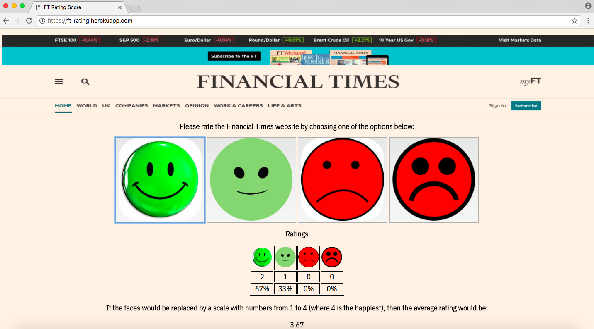
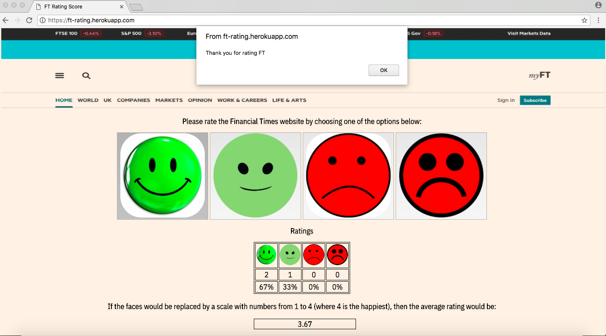

# FT Rating Score Website
=========================

## The Task

```
Build a website hosted in the cloud that asks for and stores a simple rating score for using ft.com.
```

## How to use FT Rating Score

1. Open a browser and type ``` https://ft-rating.herokuapp.com/ ```
2. For rating Financial Times, you need to click on one of the smiley options.
3. If you want to reset the values, please refresh the page.

If the heroku website is not displayed like in the below screenshots or not working, please clear your Browsing Data - cached images and files (it may happen on Chrome)

## Approach on solving the rating score website:

 - decided to use Javascript for the business logic as it's easier to have a one page website for calculating, keeping score and displaying it back on the same page.
 - tested using Jasmine framework (rating score to be added, calculated and displayed correctly)
 - decided to have RatingScore class for rating the website, calculate the average, store the rating values
 - created RatingLog class for keeping all the values chosen by the user to rate FT website, so owner could check what rating score was in a period of time (future implementations if needed)
 - display the percentage for each rating and number of clicks on a specific rating
 - add styling for the interface
 - deployed to heroku.com

## Screenshots from the heroku Website

 

 
